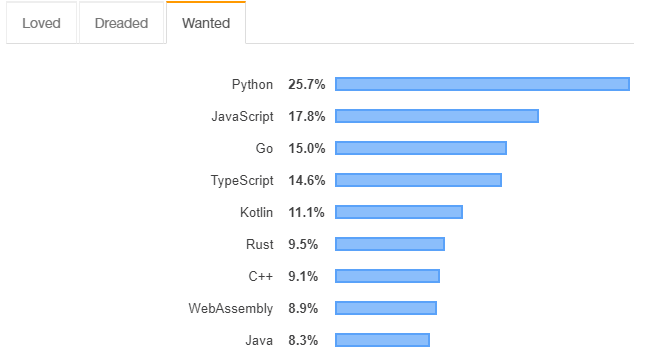
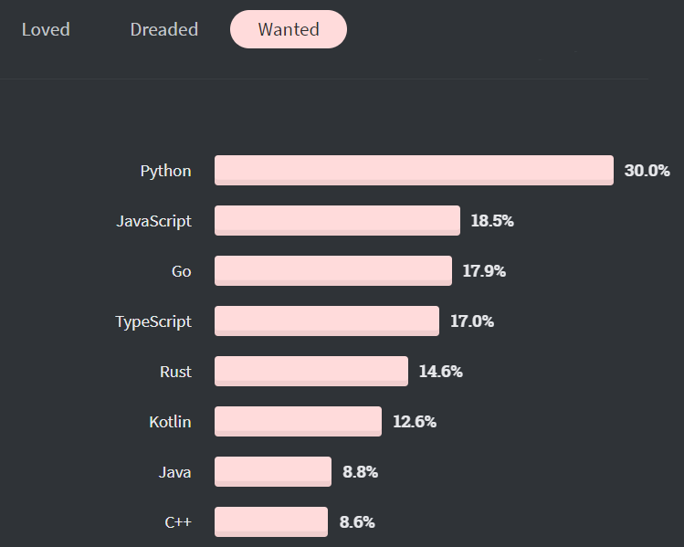

# golang-beacon

Build the main line of golang learning and become a guide for all golang learners

构建golang学习的主线，成为所有golang学习者的向导

Everything below will be written using Chinese, and if you don't know Chinese, you may need a good translation software

# 主线任务

本项目介绍：本项目是一个帮助初学者快速了解 golang 这门编程语言，以及其生态，快速帮助新手小白掌握技术要领成为一个开发经验成熟的 golang 开发者的知识性分享笔记。我会在项目中以任务的形式构建 golang 每个阶段需要做的事情，帮助迷茫的学习者找到学习的方向和参考。

下边是本项目设计的第一个任务，也是主线任务。

上图所示的内容就是本项目的整个主线任务内容，项目的所有任务都会贯穿始终，层层通关之后，你将会成为一个优秀的 **golang** 开发者。

# FOUNDATION

## 认知

人类学习一个新的事物总是从认知开始的，了解这个事物的外貌、结构、特征、功能、作用..... 等诸多维度来提升我们对一个事物的认知，只有对这个事物足够了解了，才能更好的学习和了解其中的奥义。

## golang发展史
- 2022年11月12日12:48:51，从这里开始我们将真正意义开始进行主线的第一个任务 Foundation.
  
> Golang(又称Go)是Google公司开发的一种`静态强类型`、`编译型`、`并发型`，并具有`垃圾回收`功能的`编程语言`。罗伯特·格瑞史莫，罗勃·派克（Rob Pike）及肯·汤普逊于2007年9月开始设计GO，稍后Ian Lance Taylor、Russ Cox加入项目。Go是基于Inferno操作系统所开发的。Go于2009年11月正式宣布推出，成为开放源代码项目，支持Linux、macOS、Windows等操作系统。在2016年，Go被软件评价公司TIOBE 选为“TIOBE 2016 年最佳语言”。

请你思考以下几个问题，这是你能继续学习下去的驱动力。

- golang 为什么被设计出来？
- 为什么需要学习Golang？

早期的采访中，Google 大佬们对于现在工作所用的语言和环境感觉比较沮丧，充满着许多不怎么好用的特性。具体遭遇到的问题。如下：

- 软件过于复杂：多核处理器、网络系统、大规模计算集群、分布式集群和网络编程模型等所带来的诸多问题只能暂时绕开，都没法真正得到很好的解决。

- 软件规模越发庞大：时至今日软件规模也发生了很大的变化，今天的服务器程序由数百甚至数千名程序员协同工作而完成。
  
- 编译耗时：在大型编译集群中，构建时间也延长到了几分钟，甚至几小时。
  

在 Go 的设计上，除了比较知名的方面，如内置并发和垃圾收集。还考虑到，严格的依赖性管理，随着系统的发展，软件架构的适应性，以及跨越组件之间边界的健壮性。与大多数通用编程语言相比，Go 的设计是为了解决我们在构建大型服务器软件时接触到的一系列软件工程问题.

简而言之，golang设计之初就是为了解决上述的这些问题而设计的，我们希望它有 `简单的语法` `成熟的并发模型` `良好的内存分配` `高效的垃圾回收` `高效的执行性能` `优秀的包管理机制` `严谨的语言规范`.......等等

Stack Overflow 每年的开发者调查是全球规模最大、范围最全面的调查之一。2019 年的统计获得了全球近 9 万名开发者的数据。在最想使用编程语言的榜单中，Python 领先地位明显，JavaScript 和 Go 语言分列二三位。

> 图源：https://insights.stackoverflow.com/survey/2019

Go 语言的受欢迎程度正在快速上升，根据 Stack Overflow 2020 年度开发者报告的数据显示，在开发者最想使用的榜单中，虽然 Go 语言依然排在 Python 和 Javascript 后面，但比例较 2019 年有所上升。

> 图源：https://insights.stackoverflow.com/survey/2020

## 版本选择

截至2022年11月12日15:11:22
golang发行的最新版本：go1.19 (released 2022-08-02)
本项目使用的版本：go version go1.18.2 windows/amd64
编译器下载：https://go.dev/dl/

- 安装
  - 首选你需要根据你自己计算机的操作系统来选择合适的版本进行安装
  - for Mac Os：Mac OS 从 https://go.dev/dl/ 下载osx安装程序。双击启动安装。
  - for Windows：Windows 从 https://go.dev/dl/ 中下载MSI安装程序。双击启动安装并遵循提示。
  - for linux：从  https://go.dev/dl/ 下载tar文件，并将其解压到/usr/local。
- 环境配置： 注意：如果是msi安装文件，Go语言的环境变量会自动设置好。
  - windows:我的电脑----右键“属性”----“高级系统设置”-----“环境变量”----“系统变量”
    - GOROOT : Go安装路径（例如：C:\Go）
    - GOPATH：Go工程的路径（例如：E\go）。如果有多个，就以分号分隔添加
    - Path：在path中添加：C:\Go\bin;%GOPATH%\bin
  - linux / mac:
    - export GOPATH =/Users/steven/Documents/gp_project 
    - export GOROOT=/Usr/local/go 
    - export GOBIN=$GOROOT/bin 
    - export PATH=\$PATH:\$GOBIN

- 验证安装: 打开命令行，输入 `go version` , 返回版本号即为安装成功
- 安装如有疑问参考：https://zhuanlan.zhihu.com/p/82615237
  

## 编辑器选择
这里推荐使用 VsCode , 当然如果你有其他编辑器或者IDE的使用习惯，你也可以选择使用其他的编辑器进行coding。

Vscode 安装地址：https://code.visualstudio.com/download
具体安装参考：https://zhuanlan.zhihu.com/p/264785441

作为golang开发前的准备工作我就不再做过多的赘述，参考上边文章即可，下一章节将正式进入golang的学习。

## FOUNDATION 任务一：Hello，golang
按照编程语言的学习惯例，第一天我们的任务是了解语言的发展历史和特性；以及编译器或者解释器等安装，完成编辑器IDE的安装之后，全部的预备工作都完成了将会踏出学习golang的第一步 Hello，golang
打开vscode，创建第一个go文件 hello_golang.go , vscode 会弹出扩展安装提示，如果直接选择安装大概率是会出现安装失败的如下图所示：

直接点击 install All ，大概率会出现以下结果

~~~bash
Installing github.com/mdempsky/gocode FAILED
Installing github.com/uudashr/gopkgs/cmd/gopkgs FAILED
Installing github.com/ramya-rao-a/go-outline FAILED               
Installing github.com/acroca/go-symbols FAILED
Installing golang.org/x/tools/cmd/guru FAILED
Installing golang.org/x/tools/cmd/gorename FAILED
Installing github.com/go-delve/delve/cmd/dlv SUCCEEDED
Installing github.com/stamblerre/gocode FAILED
Installing github.com/rogpeppe/godef SUCCEEDED
Installing github.com/sqs/goreturns FAILED
Installing golang.org/x/lint/golint FAILED
~~~

为了解决这个问题，你需要执行下边两行命令：
~~~bash
go env -w GO111MODULE=on
go env -w GOPROXY=https://goproxy.cn,direct
~~~

然后退出vscode 重新打开vscode后,上边的扩展弹窗还会出现，此时点击install All 大概率会安装成功如下：
~~~
Installing github.com/cweill/gotests/gotests@v1.6.0 (C:\Users\99224\go\bin\gotests.exe) SUCCEEDED
Installing github.com/cweill/gotests/gotests@v1.6.0 (C:\Users\99224\go\bin\gotests.exe) SUCCEEDED
Installing github.com/fatih/gomodifytags@v1.16.0 (C:\Users\99224\go\bin\gomodifytags.exe) SUCCEEDED
Installing github.com/fatih/gomodifytags@v1.16.0 (C:\Users\99224\go\bin\gomodifytags.exe) SUCCEEDED
Installing github.com/josharian/impl@v1.1.0 (C:\Users\99224\go\bin\impl.exe) SUCCEEDED
Installing github.com/josharian/impl@v1.1.0 (C:\Users\99224\go\bin\impl.exe) SUCCEEDED
Installing github.com/haya14busa/goplay/cmd/goplay@v1.0.0 (C:\Users\99224\go\bin\goplay.exe) SUCCEEDED
Installing github.com/haya14busa/goplay/cmd/goplay@v1.0.0 (C:\Users\99224\go\bin\goplay.exe) SUCCEEDED
Installing github.com/go-delve/delve/cmd/dlv@latest (C:\Users\99224\go\bin\dlv.exe) SUCCEEDED
Installing github.com/go-delve/delve/cmd/dlv@latest (C:\Users\99224\go\bin\dlv.exe) SUCCEEDED
Installing honnef.co/go/tools/cmd/staticcheck@latest (C:\Users\99224\go\bin\staticcheck.exe) SUCCEEDED
Installing honnef.co/go/tools/cmd/staticcheck@latest (C:\Users\99224\go\bin\staticcheck.exe) SUCCEEDED
Installing golang.org/x/tools/gopls@latest (C:\Users\99224\go\bin\gopls.exe) SUCCEEDED
Installing golang.org/x/tools/gopls@latest (C:\Users\99224\go\bin\gopls.exe) SUCCEEDED
~~~

如果执行了上述两个命令还不能正常安装成功的话你可以尝试使用git直接拉取
~~~bash
git clone https://github.com/golang/tools.git 
git clone https://github.com/golang/lint.git
git clone https://github.com/golang/sync.git
~~~

然后重启vscode，即可重新安装插件扩展。

完成上边的扩展安装之后，我们将正式开始编写我们的第一个golang程序 hello_golang.go
~~~go

package main
import "fmt"

func main(){
	fmt.Println("hello golang");
}
~~~
注意 go 有严格的语法规范：
- 首先第一个就是每个文件必须要归属于一个包既 `package 包名`
- 然后第二个所有导入的包或者定义的变量都必须要被使用
  - 这里`import "fmt" ` 导入了 fmt 这个包，那么就必须要使用，否则会报错。
- 第三，go跟C语言一样，都是从main函数开始执行程序。
- 第四，如果括号是 `{}` 左边的括号不要换到下行。

编写完上边的代码之后,注意文件后缀 `文件名.go`
你可以通过以下命令进行编译
~~~go
go build 文件名
~~~
然后你会发现多了一个可执行文件
当然你也可以直接使用下边命令直接编译运行，且生成的临时可执行文件不会被保存。
~~~go
go run 文件名
~~~

以上就是go构建程序编译的两个命令了。

除此之外由于新手在编写go的时候常常会因为编写格式不规范而出现各种各样的错误，你可以通过以下命令对文件进行格式化。
~~~go
gofmt -l xxx.go
~~~

当然这样只是输出到控制台，你可以通过 -w选项将格式化后的代码重新写入到文件中。
此外 `gofmt` 还要以下选项：
- -l 显示那些需要格式化的文件
- -w把改写后的内容直接写入到文件中，而不是作为结果打印到标准输出。
- -r添加形如“a[b:len(a)]->a[b:]”的重写规则，方便我们做批量替换
- -s简化文件中的代码
- -d显示格式化前后的diff而不是写入文件，默认是false
- -e打印所有的语法错误到标准输出。如果不使用此标记，则只会打印不同行的前10个错误。
- -cpuprofile支持调试模式，写入相应的cpufile到指定的文件

以上就是本次任务的全部内容。
